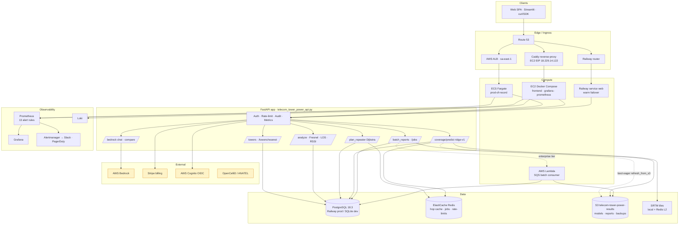
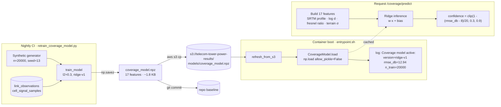
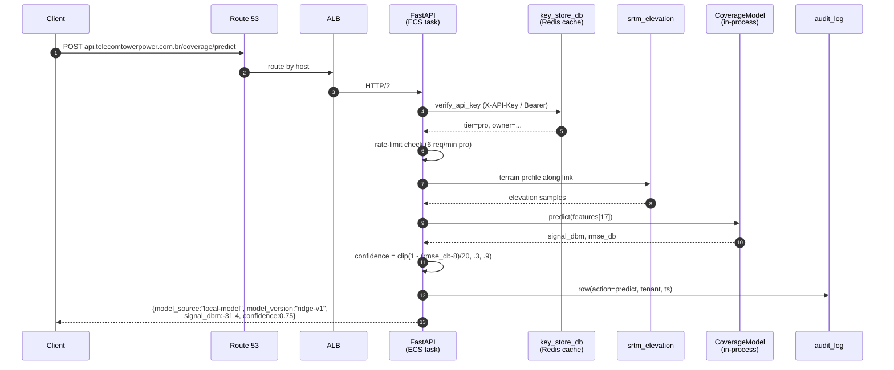

# Arquitetura

Visão de alto nível da plataforma TELECOM TOWER POWER em produção.

## Topologia geral



## Pipeline de ML — *terrain-aware* signal predictor



## Ciclo de vida de uma requisição `/coverage/predict`



## Camadas

### Verified summary (`Apr 2026`)

| Layer | Implementation |
|---|---|
| **Primary API** | FastAPI (Python 3.13) — prod traffic via Caddy on EC2 t3.small (sa-east-1) reverse-proxied to Railway; ECS Fargate task-def rev 44 kept warm. Local stack: **18-service** Docker Compose. |
| **Database** | PostgreSQL **18.3** on Railway (managed) — **140,498** towers (verified from nightly dump). |
| **Cache & Queue** | Redis 8.6.2 (SRTM cache, hop cache, jobs, rate-limits). |
| **Batch** | Hybrid: ≤100 rows sync; >100 rows async via SQS → Lambda → S3. |
| **AI & ML** | AWS Bedrock (Claude / Titan / Llama) for chat; ridge-v1 (`coverage_predict.py`, 17 features). |
| **Frontend** | React PWA served by Nginx 1.30 + Streamlit + MkDocs (Material). |
| **Monitoring** | Prometheus v3.11.2 + Grafana 13.0.1 + Alertmanager v0.32.0 + Jaeger 1.76.0 (OTLP). |
| **Failover** | Railway active for `api.*`; ECS Fargate kept warm; Route 53 latency-based failover **planned**. |
| **Backups** | Nightly: Grafana volume → S3 (~23.05 MB), Railway Postgres → S3 (~1.78 MB gzip, weekly verified restore). |
| **CI/CD** | **19** GitHub Actions workflows (deploy, backup, drift, failover, retrain, secrets sync, …). |
| **TLS** | ACM on ALB (sa-east-1) terminates HTTPS; Caddy on EC2 serves :80 origin only. |

| Layer | Components | Function |
|---|---|---|
| **Edge** | ALB · Caddy · Railway router · Route 53 (DNS failover) | TLS termination, host routing, health checks |
| **Compute** | ECS Fargate (primary) · EC2 + Docker Compose · Railway · AWS Lambda (`sqs_lambda_worker.py`) | API + workers + bursty batch consumer |
| **Application** | FastAPI (`telecom_tower_power_api.py`) + Streamlit (`frontend.py`) + React SPA | HTTP / WebSocket / SSE surfaces |
| **Data** | Railway PostgreSQL 18.3 · ElastiCache Redis · S3 (artifacts + backups) · SRTM cache (`hop_cache.py`, `srtm_elevation.py`) | Persistent state, hot caches, terrain |
| **ML** | ridge-v1 in `.npz` · S3 hot-pull · nightly retrain in CI · Bedrock for scenarios | Terrain-aware signal prediction + GenAI |
| **Async** | SQS priority queue · Lambda consumer · `batch_worker.py` · `repeater_jobs_store.py` (Redis) | Long PDF batches and ≥4-hop planning |
| **Auth** | API keys (`key_store_db.py`) · Cognito OIDC + Bearer · per-tier rate limits · audit log | OWASP-Top-10 hardening |
| **Observability** | Prometheus (13 rules) · Grafana · Alertmanager · OpenTelemetry · Loki | Metrics, dashboards, paging (Slack + PagerDuty) |
| **CI/CD** | 16 GitHub Actions workflows · BuildKit cache · secret sync via SSM · weekly restore drill | Push-to-deploy, nightly retrain, restore drill |
| **Backups** | Postgres + Grafana volume → S3 nightly (14d retention) · weekly verified restore | DR, RPO ≈ 24h |

## 🧠 Key Algorithms

| Feature | Implementation |
|---|---|
| **Link budget** | Free-space path loss + Fresnel zone + earth curvature (effective radius `k=4/3`). See [pdf_generator.py](https://github.com/danielnovais-tech/TELECOM-TOWER-POWER/blob/main/pdf_generator.py) (`_free_space_path_loss`, first-zone envelope, `earth_bulge`). |
| **Repeater planning** | **Bottleneck-shortest-path** Dijkstra (min-max) over candidate towers; relaxation `new_bottleneck = max(bottleneck, effective_loss)` with terrain-scored `effective_loss` ([telecom_tower_power_api.py#L731](https://github.com/danielnovais-tech/TELECOM-TOWER-POWER/blob/main/telecom_tower_power_api.py#L731)). |
| **PDF reports** | ReportLab for tables/layout + Matplotlib for the terrain + Fresnel-zone plot ([pdf_generator.py](https://github.com/danielnovais-tech/TELECOM-TOWER-POWER/blob/main/pdf_generator.py)). |
| **ML signal prediction** | Ridge regression on **17 engineered features** (SRTM profiles, slope, obstruction count, min Fresnel ratio, log/interaction terms). Trained on synthetic physics (`_physics_signal`) + log-normal shadow fading, with optional real-data up-weighting. **Fallback chain:** SageMaker endpoint → local `.npz` model → deterministic physics ([coverage_predict.py](https://github.com/danielnovais-tech/TELECOM-TOWER-POWER/blob/main/coverage_predict.py) — `_FEATURE_NAMES`, `predict_signal`). |

## 🗄️ Data Pipeline

**Tower sources**

- **ANATEL** (official) — 105,240 unique stations (Postgres prod count).
  Geocoded via IBGE municipality centroids + small random jitter (~800 m)
  so same-city towers don't stack
  ([load_anatel.py](https://github.com/danielnovais-tech/TELECOM-TOWER-POWER/blob/main/load_anatel.py)).
- **OpenCelliD** (crowdsourced) — 35,248 GPS-tagged cells
  ([load_opencellid.py](https://github.com/danielnovais-tech/TELECOM-TOWER-POWER/blob/main/load_opencellid.py)).

**Geocoding**

- Pre-built lookup table of ~5,570 IBGE municipalities in
  `municipios_brasileiros.csv` → centroid + ±jitter.
- Cache misses fall back to Nominatim (rate-limited to 1.1 req/s).
- **ANATEL→OpenCelliD snap pass** (
  [snap_anatel.py](https://github.com/danielnovais-tech/TELECOM-TOWER-POWER/blob/main/snap_anatel.py)):
  for every `ANATEL_*` tower, find the closest `OCID_*` tower of the
  **same operator** within a configurable radius (default **5 km**) using
  a 0.05° spatial bucket index + haversine distance; rewrite `lat`/`lon`
  to the candidate's, keeping the `id`. 3×3 bucket lookup, O(N) overall.
  CLI: `python snap_anatel.py [--max-km 5.0] [--dry-run]`.

**SRTM elevation tiles (90 m)**

- Local `.hgt` files in `./srtm_data/` (L1 in-process cache).
- Optional Redis L2 cache: raw `.hgt` blobs, 7-day TTL
  ([srtm_elevation.py](https://github.com/danielnovais-tech/TELECOM-TOWER-POWER/blob/main/srtm_elevation.py)
  — key `srtm:<tile>`).
- No Open-Elevation API fallback today; missing tile → `ValueError`.

**Nightly sync (AWS RDS → Railway)**

- [.github/workflows/sync-towers.yml](https://github.com/danielnovais-tech/TELECOM-TOWER-POWER/blob/main/.github/workflows/sync-towers.yml),
  cron `05:00 UTC`.
- SSM port-forward via EC2 bastion (no SG ingress) → `localhost:15432`
  → `RDS:5432`; runs
  `import_towers.py --source-env AWS --target-env RAILWAY --delete-missing`.

## S3 — single source of truth

```
s3://telecom-tower-power-results/
├── models/coverage_model.npz          ← ML artifact (ridge-v1, 1850 B)
├── reports/{tenant}/{job_id}.zip      ← async batch outputs
├── backups/postgres/YYYY-MM-DD.sql.gz ← nightly pg_dump
└── backups/grafana/YYYY-MM-DD.tar.gz  ← nightly Grafana volume snapshot
```
