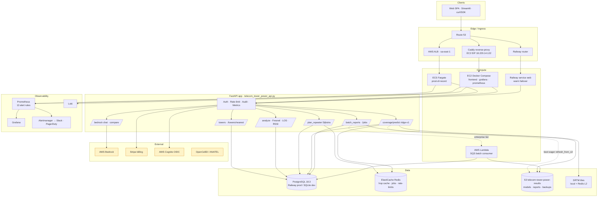
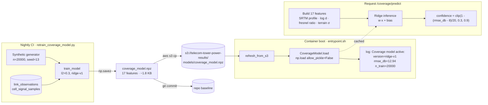
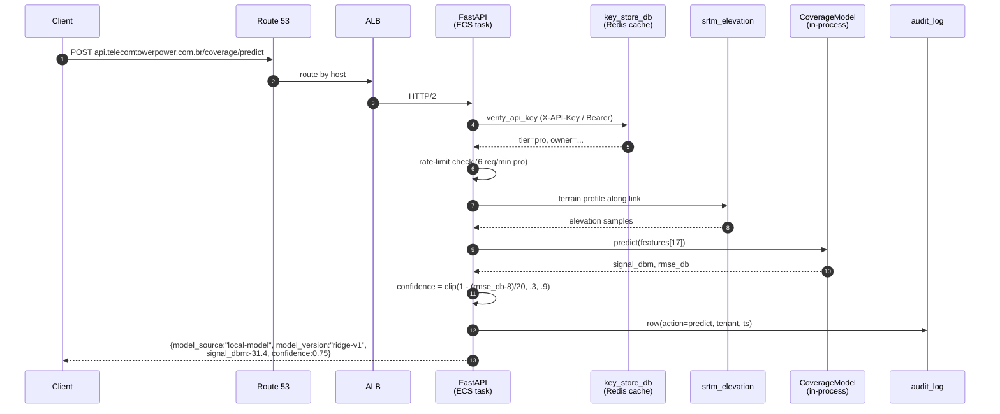

# Arquitetura

Visão de alto nível da plataforma TELECOM TOWER POWER em produção.

## Topologia geral



## Pipeline de ML — *terrain-aware* signal predictor



## Ciclo de vida de uma requisição `/coverage/predict`



## Camadas

### Resumo verificado (`abr/2026`)

| Camada | Implementação |
|---|---|
| **Primary API** | FastAPI (Python 3.13) — tráfego de produção via Caddy em EC2 t3.small (sa-east-1) com reverse-proxy para Railway; ECS Fargate (task-def rev 44) mantida como hot-warm. Stack local: Docker Compose com **18 serviços**. |
| **Database** | PostgreSQL **18.3** em Railway (managed) — **140.498** torres (verificado no dump nightly). |
| **Cache & Queue** | Redis 8.6.2 (cache SRTM, hop cache, jobs, rate-limits). |
| **Batch** | Híbrido: ≤1 100 linhas síncrono; >100 linhas assíncrono via SQS → Lambda → S3. |
| **AI & ML** | AWS Bedrock (Claude / Titan / Llama) para chat; ridge-v1 (`coverage_predict.py`, 17 features). |
| **Frontend** | React PWA servida por Nginx 1.30 + Streamlit + MkDocs (Material). |
| **Monitoring** | Prometheus v3.11.2 + Grafana 13.0.1 + Alertmanager v0.32.0 + Jaeger 1.76.0 (OTLP, head sampling 5% via `ParentBased(TraceIdRatioBased(0.05))` em [tracing.py](https://github.com/danielnovais-tech/TELECOM-TOWER-POWER/blob/main/tracing.py); ajustável via `OTEL_TRACES_SAMPLER_ARG`). |
| **Failover** | Route 53 **Failover routing** (PRIMARY=ALB sa-east-1, SECONDARY=Railway edge) com health checks ALB; Railway warm para `api.*`; drift detectado por `failover-drift-check.yml`. |
| **Backups** | Nightly: Grafana volume → S3 (~23,05 MB), Railway Postgres → S3 (~1,78 MB gzip, restore verificado semanal). |
| **CI/CD** | **19** workflows GitHub Actions (deploy, backup, drift, failover, retrain, secrets sync, …). |
| **TLS** | ACM no ALB (sa-east-1) termina HTTPS; Caddy em EC2 atende :80 como origin only. |

| Camada | Componentes | Função |
|---|---|---|
| **Edge** | ALB · Caddy · Railway router · Route 53 (DNS failover) | TLS termination, host routing, health checks |
| **Compute** | ECS Fargate (primary) · EC2 + Docker Compose · Railway · AWS Lambda (`sqs_lambda_worker.py`) | API + workers + bursty batch consumer |
| **Application** | FastAPI (`telecom_tower_power_api.py`) + Streamlit (`frontend.py`) + React SPA | HTTP / WebSocket / SSE surfaces |
| **Data** | Railway PostgreSQL 18.3 · ElastiCache Redis · S3 (artefactos + backups) · cache SRTM (`hop_cache.py`, `srtm_elevation.py`) | Estado persistente, caches quentes, terreno |
| **ML** | ridge-v1 em `.npz` · S3 hot-pull · retrain noturno em CI · Bedrock para cenários | Predição de sinal terrain-aware + GenAI |
| **Async** | SQS priority queue · Lambda consumer · `batch_worker.py` · `repeater_jobs_store.py` (Redis) | Batches PDF longos e planejamento ≥4 hops |
| **Auth** | API keys (`key_store_db.py`) · Cognito OIDC + Bearer · rate limits por tier · audit log | Hardening OWASP-Top-10 |
| **Observability** | Prometheus (13 regras) · Grafana · Alertmanager · OpenTelemetry · Loki | Métricas, dashboards, paging (Slack + PagerDuty) |
| **CI/CD** | 19 workflows GitHub Actions · BuildKit cache · sync de secrets via SSM · drill semanal de restore | Push-to-deploy, retrain noturno, restore drill |
| **Backups** | Postgres + volume Grafana → S3 nightly (14d retenção) · restore verificado semanal | DR, RPO ≈ 24h |

## 🧠 Key Algorithms

| Feature | Implementation |
|---|---|
| **Link budget** | Free-space path loss + zona de Fresnel + curvatura terrestre (raio efetivo `k=4/3`). Ver [pdf_generator.py](https://github.com/danielnovais-tech/TELECOM-TOWER-POWER/blob/main/pdf_generator.py) (`_free_space_path_loss`, envelope da 1ª zona, `earth_bulge`). |
| **Repeater planning** | Dijkstra de **caminho gargalo** (min-max) sobre torres candidatas; relaxação `new_bottleneck = max(bottleneck, effective_loss)` com `effective_loss` ponderado por terreno ([telecom_tower_power_api.py#L731](https://github.com/danielnovais-tech/TELECOM-TOWER-POWER/blob/main/telecom_tower_power_api.py#L731)). |
| **PDF reports** | ReportLab para tabelas/layout + Matplotlib para o plot de terreno + zona de Fresnel ([pdf_generator.py](https://github.com/danielnovais-tech/TELECOM-TOWER-POWER/blob/main/pdf_generator.py)). |
| **ML signal prediction** | Regressão ridge sobre **17 features** engenhadas (perfis SRTM, slope, contagem de obstruções, razão mínima de Fresnel, termos log/interação). Treinada em física sintética (`_physics_signal`) + sombra log-normal, com up-weight opcional de dados reais. **Cadeia de fallback:** SageMaker endpoint → modelo local `.npz` → física determinística ([coverage_predict.py](https://github.com/danielnovais-tech/TELECOM-TOWER-POWER/blob/main/coverage_predict.py) — `_FEATURE_NAMES`, `predict_signal`). |

## 🗄️ Data Pipeline

**Tower sources**

- **ANATEL** (oficial) — 105.240 estações únicas (contagem da prod Postgres).
  Geocodificadas via centroides de municípios IBGE + jitter aleatório leve
  (~800 m) para que torres da mesma cidade não se sobreponham
  ([load_anatel.py](https://github.com/danielnovais-tech/TELECOM-TOWER-POWER/blob/main/load_anatel.py)).
- **OpenCelliD** (crowdsourced) — 35.248 células com GPS
  ([load_opencellid.py](https://github.com/danielnovais-tech/TELECOM-TOWER-POWER/blob/main/load_opencellid.py)).

**Geocodificação**

- Tabela pré-construída com ~5.570 municípios IBGE em
  `municipios_brasileiros.csv` → centroide + ±jitter.
- Cache miss recorre ao Nominatim (rate-limit 1,1 req/s).
- **Refinamento ANATEL→OpenCelliD** (
  [snap_anatel.py](https://github.com/danielnovais-tech/TELECOM-TOWER-POWER/blob/main/snap_anatel.py)):
  para cada torre `ANATEL_*`, encontra a torre `OCID_*` mais próxima do
  **mesmo operador** dentro de um raio configurável (padrão **5 km**) usando
  índice por buckets de 0,05° + distância haversine; grava `lat`/`lon` da
  candidata, mantendo o `id`. Cobertura por bucket = 3×3, operação O(N).
  CLI: `python snap_anatel.py [--max-km 5.0] [--dry-run]`.

**Tiles SRTM (90 m)**

- Arquivos `.hgt` locais em `./srtm_data/` (cache L1 in-process).
- Cache L2 opcional em Redis: blobs `.hgt` brutos, TTL de 7 dias
  ([srtm_elevation.py](https://github.com/danielnovais-tech/TELECOM-TOWER-POWER/blob/main/srtm_elevation.py)
  — chave `srtm:<tile>`).
- Sem fallback Open-Elevation hoje; tile ausente → `ValueError`.

**Sync noturno (AWS RDS → Railway)**

- [.github/workflows/sync-towers.yml](https://github.com/danielnovais-tech/TELECOM-TOWER-POWER/blob/main/.github/workflows/sync-towers.yml),
  cron `05:00 UTC`.
- Tunelamento SSM via bastion EC2 (sem ingress de SG) → `localhost:15432`
  → `RDS:5432`; executa
  `import_towers.py --source-env AWS --target-env RAILWAY --delete-missing`.

## S3 — single source of truth

```
s3://telecom-tower-power-results/
├── models/coverage_model.npz          ← artefato ML (ridge-v1, 1850 B)
├── reports/{tenant}/{job_id}.zip      ← saídas async batch
├── backups/postgres/YYYY-MM-DD.sql.gz ← pg_dump nightly
└── backups/grafana/YYYY-MM-DD.tar.gz  ← snapshot de volume nightly
```
